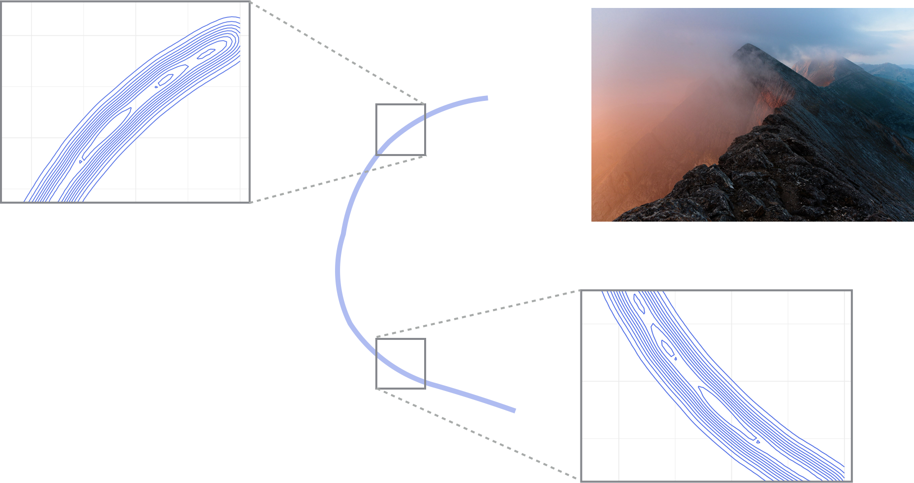



## Outline 

### Topics

- Notion of mixing.
- Heuristics to detect pathological behaviour 

### Rationale

We have seen that [MCMC is consistent](../w08_mcmc1/topic05_mcmc_consistency.qmd), 
however the speed of convergence can vary considerably due to the 
dependence between the successive draws. 

When convergence is too slow it may be necessary to change the inference algorithm, 
either into another MCMC algorithm or to a variational method. 


## Overview

Informally, there are two possible situations to distinguish:

**Fast mixing:**

- The chain is almost like i.i.d. sampling, just a **constant time** slower (e.g., 2x slower).
    - This constant is related to the relative effective sample size (e.g., if 2x slower, relative ESS would be $1/2$).
    - Notice Stan estimates ESS when printing a `fit` object, look for column `ess_bulk`.[^1]
    - More on this soon.
- Fast mixing happens when the dependence between time step $i$ and $i+m$ decays exponentially in $m$.[^2]

[^1]: The column `ess_bulk` was called `n_eff` in older versions.

[^2]: "Fast mixing" is often formalized using [one of several equivalent definitions of geometric ergodicity](https://arxiv.org/pdf/2203.04395.pdf).


**Slow/torpid mixing:**

- Terminology: **slow/torpid mixing**. 
- MCMC still consistent, but you may have to wait for years to get a usable answer!
- In this case, changes have to be made to the sampler. 
- We will cover two alternatives to consider for these difficult targets:
    - Tempering methods (week 12).
    - Variational methods (week 13).
    
    
## Heuristics to detect slow mixing chains

- Key idea: run several independent chains from "over-dispersed" initializations. 
    - Over-dispersed: use at least as much noise as the prior (roughly). 
- Check for differences between the independent chains:
    - Trace plots.
    - Rank plots. 
- These are not bullet-proof methods... 
- ... but it is still a good idea to use them unless theory provides guarantees (e.g. [log-concave distributions](https://jmlr.org/papers/volume20/19-306/19-306.pdf)).


### Examples

```{r}
suppressPackageStartupMessages(library(cmdstanr))
suppressPackageStartupMessages(library(ggplot2))
suppressPackageStartupMessages(library(bayesplot))
```


**Easy problem:** a familiar beta-binomial problem.

```stan {shortcodes=true, filename="betabinom.stan"}

```

**Challenging problem:** binomial likelihood, but with "too many parameters."

- Write $p = p_1 p_2$, where $p_i \sim \distUnif(0, 1)$.
- This creates an **unidentifiability**: for each value $p$ there are several possible $p_1, p_2$ such that $p = p_1 p_2$.
- The posterior looks like a "thin ridge" (see visualization [here](https://julia-tempering.github.io/InferenceReport.jl/stable/generated/toy_turing_unid_model/src/), obtained using tempering, covered in week 12).

::: column-margin
{width="300"}
:::

```stan {shortcodes=true, filename="unid.stan"}

```

- We run both easy and hard problems with 2 parallel chains each.
- In practice use more than 2. 


```{r message=FALSE, warning=FALSE, results=FALSE}

hard = cmdstan_model("unid.stan")
easy = cmdstan_model("betabinom.stan")
dat = list(n_trials=1000000000, n_successes=1000000000/2)
fit_easy = easy$sample(
  seed = 1,
  chains = 2,
  refresh = 0,
  output_dir = "stan_out",
  data = dat, 
)
fit_hard = hard$sample(
  seed = 1,
  chains = 2,
  refresh = 0,
  output_dir = "stan_out",
  data = dat, 
)
```


**Trace plots:** spot the difference between the easy and hard problems 
(each line in a given plot is an independent chain).

```{r}
mcmc_trace(fit_easy$draws("p")) + theme_minimal()
mcmc_trace(fit_hard$draws("p1")) + theme_minimal()
```

**Rank histogram:** 

- First look at the chains combined and compute ranks (i.e. sort the values of one parameter $\{p_1^{(m,1)}\} \cup \{p_1^{(m,2)}\}$ where $\{p_1^{(m,c)}\}$ are the samples for chain $c$, here $c\in\{1, 2\}$).
- Display for each chain the rank distribution for the samples in that chain. 
- In the fast mixing case, all histograms should be approximately uniform.

```{r}
mcmc_rank_hist(fit_easy$draws("p")) + ylab("number of MCMC samples with these ranks") + theme_minimal()
mcmc_rank_hist(fit_hard$draws("p1")) + ylab("number of MCMC samples with these ranks") + theme_minimal()
```
